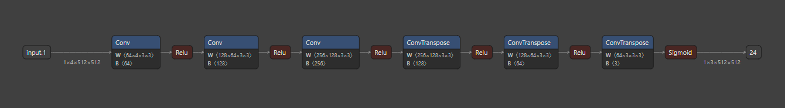

# Project Title

## Project Overview

This project focuses on the development and implementation of various autoencoder models using PyTorch. Autoencoders are neural networks used for unsupervised learning tasks, primarily for dimensionality reduction and feature learning. In this repository, we explore different architectures of autoencoders, progressively enhancing their complexity and capabilities.

## Models

### Basic Autoencoder

The basic autoencoder (`Autoencoder`) is a foundational model with a simple architecture, consisting of minimal convolutional layers in the encoder and decoder.

here is a sample: 

### Enhanced Autoencoder

The enhanced autoencoder (`Autoencoder_3`) builds upon the basic version by introducing additional convolutional layers, making it capable of capturing more complex features.

here is a sample: 

### Ultimate Autoencoder

The ultimate autoencoder (`Autoencoder_3_Ultimate`) is the most advanced model in the series, featuring a deep architecture with high-capacity layers for handling complex and high-dimensional data.

here is a sample: 

## Thanks
The model was trained using the dataset class and datas of [Paint Torch][1]

[1]: https://github.com/yliess86/PaintsTorch2
